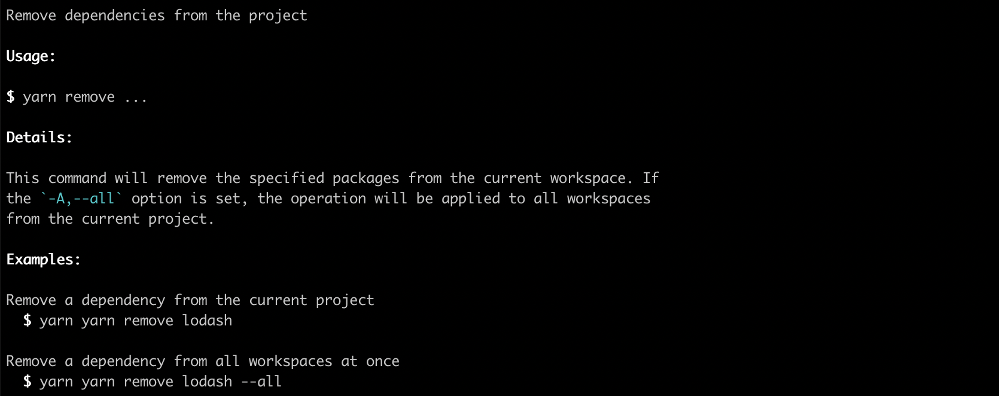
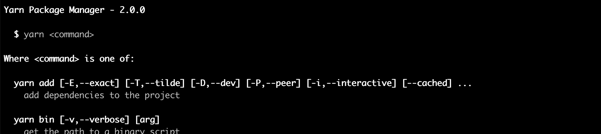

#  Clipanion

> Type-safe CLI library with no dependencies

[]() []() [](https://github.com/yarnpkg/berry)

## Installation

```
yarn add clipanion
```

## Why

  - Clipanion supports advanced typing mechanisms
  - Clipanion supports nested commands (`yarn workspaces list`)
  - Clipanion supports transparent option proxying without `--` (for example `yarn dlx eslint --fix`)
  - Clipanion supports all option types you could think of (including negations, batches, ...)
  - Clipanion offers a [Yup](https://github.com/jquense/yup) integration for increased validation capabilities
  - Clipanion generates an optimized state machine out of your commands
  - Clipanion generates good-looking help pages out of the box
  - Clipanion offers common optional command entries out-of-the-box (e.g. version command, help command)

Clipanion is used in [Yarn](https://github.com/yarnpkg/berry) with great success.

## Recommended Usage

**Note:** This syntax assumes you have some way to compile decorators. TypeScript supports them via the `experimentalDecorators` setting, and Babel via the `@babel/plugin-proposal-decorators` plugin.

In essence you just need to declare a class that extends the `Command` abstract class, and implement the `execute` method. This function will then be called by Clipanion and its return value will be set as exit code by the engine (by default the exit code will be 0, which means success).

Options and command paths are set using the `@Command` decorators, unless you're in an environment that doesn't support them (in which case check the next section to see how to use the fallback syntax). Because you're in a regular class, you can even set default values to your options as you would with any other property!

```ts
import {Cli, Command} from 'clipanion';
import * as yup from 'yup';

// greet [-v,--verbose] [--name ARG]
class GreetCommand extends Command {
    @Command.Boolean(`-v,--verbose`)
    public verbose: boolean = false;

    @Command.String(`--name`)
    public name?: string;

    @Command.Path(`greet`)
    async execute() {
        if (typeof this.name === `undefined`) {
            this.context.stdout.write(`You're not registered.\n`);
        } else {
            this.context.stdout.write(`Hello, ${this.name}!\n`);
        }
    }
}

// fibo <a> <b>
class FibonacciCommand extends Command {
    @Command.String({required: true})
    public a!: number;

    @Command.String({required: true})
    public b!: number;

    @Command.Path(`fibo`)
    async execute() {
        // ...
    }

    static schema = yup.object().shape({
        a: yup.number().integer(),
        b: yup.number().integer(),
    })
}

const cli = new Cli({
    binaryLabel: `My Utility`,
    binaryName: `bin`,
    binaryVersion: `1.0.0`,
});

cli.register(GreetCommand);
cli.register(FibonacciCommand);

cli.runExit(process.argv.slice(2), {
    ...Cli.defaultContext,
});
```

## Fallback Usage

In case the primary syntax isn't available (for example because you want to avoid any kind of transpilation), a fallback syntax is available:

```js
class GreetCommand extends Command {
    async execute() {
        // ...
    }
}

GreetCommand.addPath(`greet`);

GreetCommand.addOption(`boolean`, Command.Boolean(`-v,--verbose`));
GreetCommand.addOption(`name`, Command.String(`--name`));
```

Note that in this case the option variables never get assigned default values, so they may be undefined within the `execute` block.

## Decorators

The `optionNames` parameters all indicate that you should put there a comma-separated list of option names (along with their leading `-`). For example, `-v,--verbose` is a valid parameter.

#### `@Command.Path(segment1?: string, segment2?: string, ...)`

Specifies through which CLI path should trigger the command.

**This decorator can only be set on the `execute` function itself**, as it isn't linked to specific options.

```ts
class RunCommand extends Command {
    @Command.Path(segment1, segment2, segment3)
    async execute() {
        // ...
    }
}
```

Generates:

```bash
run segment1 segment2 segment3
```

Note that you can add as many paths as you want to a single command. By default it will be connected on the main entry point (empty path), but if you add even one explicit path this behavior will be disabled. If you still want the command to be available on both a named path and as a default entry point (for example `yarn` which is an alias for `yarn install`), simply call the decorator without segments:

```ts
class YarnCommand extends Command {
    @Command.Path(`install`)
    @Command.Path()
    async execute() {
        // ...
    }
}
```

Generates:

```bash
yarn install
# or
yarn
```

#### `@Command.String(opts: {...})`

| Option | type | Description |
| --- | --- | --- |
| `required` | `boolean` | Whether the positional argument is required or not |

Specifies that the command accepts a positional argument. By default it will be required, but this can be toggled off using `required`.

```ts
class RunCommand extends Command {
    @Command.String()
    public foo?: string;
}
```

Generates:

```bash
run <ARG>
# => foo = ARG
```

Note that Clipanion supports required positional arguments both at the beginning and the end of the positional argument list (which allows you to build CLI for things like `cp`).

```ts
class RunCommand extends Command {
    @Command.String({required: false})
    public foo?: string;

    @Command.String()
    public bar!: string;
}
```

Generates:

```bash
run value1 value2
# => foo = value1
# => bar = value2

run value
# => foo = undefined
# => bar = value

run
# invalid
```

#### `@Command.String(optionNames: string, opts: {...})`

| Option | type | Description |
| --- | --- | --- |
| `arity` | `number` | Number of arguments for the option |
| `description` | `string`| Short description for the help message |
| `hidden` | `boolean` | Hide the option from any usage list |
| `tolerateBoolean` | `boolean` | Accept the option even if no argument is provided |

Specifies that the command accepts an option that takes arguments (by default one, unless overriden via `arity`). Arguments can be specified on the command line using either `--foo=ARG` or `--foo ARG`.

```ts
class RunCommand extends Command {
    @Command.String(`-a,--arg`)
    arg?: string;
}
```

Generates:

```bash
run --arg <ARG>
run --arg=<ARG>
run -a <ARG>
run -a=<ARG>
# => arg = ARG
```

Be careful, by default, options that accept an argument must receive one on the CLI (ie `--foo --bar` wouldn't be valid if `--foo` accepts an argument).

This behaviour can be toggled off if the `tolerateBoolean` option is set. In this case, the option will act like a boolean flag if it doesn't have a value. Note that with this option on, arguments values can only be specified using the `--foo=ARG` syntax, which makes this option incompatible with arities higher than one.

```ts
class RunCommand extends Command {
    @Command.String(`--inspect`, {tolerateBoolean: true})
    public debug: boolean | string = false;
}
```

Generates:

```bash
run --inspect
# => debug = true

run --inspect=1234
# => debug = "1234"

run --inspect 1234
# invalid
```

#### `@Command.Boolean(optionNames: string, opts: {...})`

| Option | type | Description |
| --- | --- | --- |
| `description` | `string`| Short description for the help message |
| `hidden` | `boolean` | Hide the option from any usage list |

Specifies that the command accepts a boolean flag as an option.

```ts
class RunCommand extends Command {
    @Command.Boolean(`--flag`)
    public flag: boolean;
}
```

Generates:

```bash
run --flag
# => flag = true
```

#### `@Command.Counter(optionNames: string, {...})`

| Option | type | Description |
| --- | --- | --- |
| `description` | `string`| Short description for the help message |
| `hidden` | `boolean` | Hide the option from any usage list |

Specifies that the command accepts a boolean flag as an option, which will increment a counter for each detected occurrence. Each time the argument is negated, the counter will be reset to `0`. The counter won't be set unless the option is found, so you must remember to set it to an appropriate default value.

```ts
class RunCommand extends Command {
    @Command.Counter('-v,--verbose')
    public verbose: number = 0;
}
```

Generates:

```bash
run
# => verbose = 0

run -v
# => verbose = 1

run -vv
# => verbose = 2

run --verbose -v --verbose -v
# => verbose = 4

run --verbose -v --verbose -v --no-verbose
# => verbose = 0
```

#### `@Command.Array(optionNames: string, opts: {...})`

| Option | type | Description |
| --- | --- | --- |
| `arity` | `number` | Number of arguments for the option |
| `description` | `string`| Short description for the help message |
| `hidden` | `boolean` | Hide the option from any usage list |

Specifies that the command accepts a set of string arguments. The `arity` parameter defines how many values need to be accepted for each item.

```ts
class RunCommand extends Command {
    @Command.Array('--arg')
    public args: string[];

    @Command.Array('--point', {arity: 3})
    public points: [string, string, string][];
}
```

Generates:

```bash
run --arg value1 --arg value2
# => args = [value1, value2]

run --point x y z --point a b c
# => points = [['x', 'y', 'z'], ['a', 'b', 'c']]
```

#### `@Command.Rest(opts: {...})`

| Option | type | Description |
| --- | --- | --- |
| `required` | `number` | Number of required trailing arguments |

Specifies that the command accepts an unlimited number of positional arguments. By default no arguments are required, but this can be changed by setting the `required` option.

```ts
class RunCommand extends Command {
    @Command.Rest()
    public values: string[];
    // ...
}
```

Generates:

```bash
run value1 value2
# => values = [value1, value2]

run value1
# => values = [value1]

run
# => values = []
```

**Note:** Rest arguments are strictly positionals. All options found between rest arguments will be consumed as options of the `Command` instance. If you wish to forward a list of option to another command without having to parse them yourself, use `Command.Proxy` instead.

**Note:** Rest arguments can be surrounded by other *finite* *non-optional* positionals such as `Command.String({required: true})`. Having multiple rest arguments in the same command is however invalid.

**Advanced Example:**

```ts
class CopyCommand extends Command {
    @Command.Rest({required: 1})
    sources: string[] = [];

    @Command.String()
    destination!: string;

    @Command.Boolean(`-f,--force`)
    force: boolean = false;

    @Command.String(`--reflink`, {tolerateBoolean: true})
    reflink: string | boolean = false;

    // ...
}
```

Generates:

```bash
run src dest
# => sources = [src]; destination = dest

run src1 src2 dest
# => sources = [src1, src2]; destination = dest

run src1 --force src2 dest
# => sources = [src1, src2]; destination = dest; force = true

run src1 src2 --reflink=always dest
# => sources = [src1, src2]; destination = dest; reflink = always

run src
# => Error - Not enough positional arguments.

run dest
# => Error - Not enough positional arguments.
```

#### `@Command.Proxy(opts: {...})`

| Option | type | Description |
| --- | --- | --- |
| `required` | `number` | Number of required trailing arguments |

Specifies that the command accepts an infinite set of positional arguments that will not be consumed by the options of the `Command` instance. Use this decorator instead of `Command.Rest` when you wish to forward arguments to another command parsing them in any way. By default no arguments are required, but this can be changed by setting the `required` option.

```ts
class RunCommand extends Command {
    @Command.Proxy()
    public args: string[];
    // ...
}
```

Generates:

```bash
run value1 value2
# => values = [value1, value2]

run value1 --foo
# => values = [value1, --foo]

run --bar=baz
# => values = [--bar=baz]
```

**Note:** Proxying can only happen once per command. Once triggered, a command can't get out of "proxy mode", all remaining arguments being proxied into a list. "Proxy mode" can be triggered in the following ways:

- By passing a positional or an option that doesn't have any listeners attached to it. This happens when the listeners don't exist in the first place.

- By passing a positional that doesn't have any *remaining* listeners attached to it. This happens when the listeners have already consumed a positional.

- By passing the `--` separator before an option that has a listener attached to it. This will cause Clipanion to activate "proxy mode" for all arguments after the separator, *without* proxying the separator itself. In all other cases, the separator *will* be proxied and *not* consumed by Clipanion.

## Command Help Pages

Clipanion automatically adds support for the `-h` option to all the commands that you define. The information printed will come from the `usage` property attached to the class. For example, the following command:

```ts
class YarnAdd extends Command {
    static usage = Command.Usage({
        description: `remove dependencies from the project`,
        details: `
            This command will remove the specified packages from the current workspace. If the \`-A,--all\` option is set, the operation will be applied to all workspaces from the current project.
        `,
        examples: [[
            `Remove a dependency from the current project`,
            `$0 remove lodash`,
        ], [
            `Remove a dependency from all workspaces at once`,
            `$0 remove lodash --all`,
        ]],
    });
}
```

Will generate something like this:



Note that the inline code blocks will be automatically highlighted.

## Optional Built-in Command Entries

Clipanion offers common optional command entries out-of-the-box, under the `Command.Entries` namespace.

They have to be manually registered:
```ts
cli.register(Command.Entries.Help);
cli.register(Command.Entries.Version);
```

### Help Command - General Help Page

> Paths: `-h`, `--help`

The `Command.Entries.Help` command displays the list of commands available to the application, printing a block similar to the following.



### Version Command

> Paths: `-v`, `--version`

The `Command.Entries.Version` command displays the version of the binary provided under `binaryVersion` when creating the CLI.

## Composition

Commands can call each other by making use of their `cli` internal property:

```ts
class FooCommand extends Command {
    @Command.Path(`foo`)
    async execute() {
        this.context.stdout.write(`Hello World\n`);
    }
}

class BarCommand extends Command {
    @Command.Path(`bar`)
    async execute() {
        this.cli.run([`foo`]);
    }
}
```

## Inheritance

Commands can extend each other and inherit options from each other:

```ts
abstract class BaseCommand extends Command {
    @Command.String(`--cwd`, {hidden: true})
    cwd?: string;

    abstract execute(): Promise<number | void>;
}

class FooCommand extends BaseCommand {
    @Command.String('--foo,-f')
    public foo?: string;

    async execute() {
        this.context.stdout.write(`Hello from ${this.cwd ?? process.cwd()}!\n`);
        this.context.stdout.write(`This is foo: ${this.foo}.\n`);
    }
}
```

**Note:** Because of the decorator evaluation order, positional arguments of a subclass will be consumed before positional arguments of a superclass. Because of this, it is not recommended to inherit anything other than options and handlers.

## Lazy evaluation

Many commands have the following form:

```ts
import {uniqBy} from 'lodash';

export class MyCommand extends Command {
    async execute() {
        // ...
    }
}
```

While it works just fine, if you have a lot of command, each with its own set of dependencies (here, `lodash`), the startup time may suffer. This is because the `import` statements will always be eagerly evaluated, even if the command doesn't end up being used in the end. To solve this problem, you can move your imports inside the body of the `execute` function, thus making sure they'll only be evaluated if actually relevant:

```ts
export class MyCommand extends Command {
    async execute() {
        const {uniqBy} = await import(`lodash`);

        // ...
    }
}
```

This strategy is slightly harder to read, so it may not be necessary in every situation. If you like living on the edge, the [`babel-plugin-lazy-import`](https://github.com/arcanis/babel-plugin-lazy-import) plugin is meant to automatically apply this kind of transformation - although it requires you to run Babel on your sources.

## Contexts

Commands share what is called a *context*. Contexts are a set of values defined when calling the `run` function from the CLI instance that will be made available to the commands via `this.context`. The default context contains properties for `stdin`, `stdout`, and `stderr`, but you can easily define a custom context that extends the default one:

```ts
import {BaseContext, Command} from 'clipanion';

type MyContext = BaseContext & {
    cwd: string;
};

class PwdCommand extends Command<MyContext> {
    async execute() {
        this.context.stdout.write(`${this.context.cwd}\n`);
    }
}

const cli = Cli.from<MyContext>([
    PwdCommands,
]);

cli.runExit(process.argv.slice(2), {
    ...Cli.defaultContext,
    cwd: process.cwd(),
});
```

Note that the context must be fully defined when calling `run` and `runExit` on the main CLI instance, but can be omitted or only partially specified when using `this.cli.run` (in which case only the specified fields will be changed).

## License (MIT)

> **Copyright © 2019 Mael Nison**
>
> Permission is hereby granted, free of charge, to any person obtaining a copy of this software and associated documentation files (the "Software"), to deal in the Software without restriction, including without limitation the rights to use, copy, modify, merge, publish, distribute, sublicense, and/or sell copies of the Software, and to permit persons to whom the Software is furnished to do so, subject to the following conditions:
>
> The above copyright notice and this permission notice shall be included in all copies or substantial portions of the Software.
>
> THE SOFTWARE IS PROVIDED "AS IS", WITHOUT WARRANTY OF ANY KIND, EXPRESS OR IMPLIED, INCLUDING BUT NOT LIMITED TO THE WARRANTIES OF MERCHANTABILITY, FITNESS FOR A PARTICULAR PURPOSE AND NONINFRINGEMENT. IN NO EVENT SHALL THE AUTHORS OR COPYRIGHT HOLDERS BE LIABLE FOR ANY CLAIM, DAMAGES OR OTHER LIABILITY, WHETHER IN AN ACTION OF CONTRACT, TORT OR OTHERWISE, ARISING FROM, OUT OF OR IN CONNECTION WITH THE SOFTWARE OR THE USE OR OTHER DEALINGS IN THE SOFTWARE.
